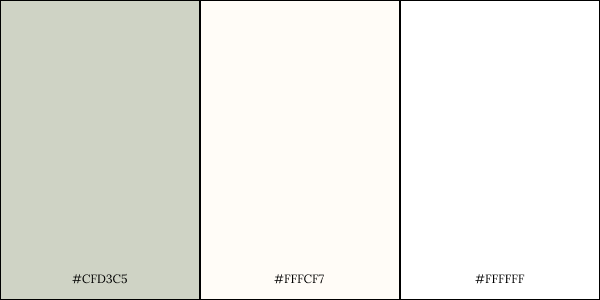

# Cakeeey.
 

Access the live demo of the website [here](https://cakeeey.netlify.app/).

## Project Summary

**Project Context**

 _Cakeeey._ is a nature focused themed artisan e-commerce shop that is involved with the sales of cakes and help the a specialised bakery business to connect, market and recieve orders from customers. It aims to be the one stop shop for all baked goods for special occasions.

**User Goals**

The aim of users is to get recommendations based on the special occasion that they would be celebrating such as birthday celebrations, mother’s day etc. while ensuring the finest quality of ingredients used in the baked goods. This includes having the product to be trackable on their account.

**Organisational Goals**

The app aims to provide users with recommendations, ease of payment and consistant updates on the orders. This ensures a smooth workflow for the business which results in a stronger customer base, thus generating a healty monetary growth.

**Justification for the App**

Cakeeey. has a unique standing in the bakery space within Singapore as it focuses on artisan centric cakes. This calls for a dedicated and highly customisable web application to meet business demands. 

## UX/UI

### **Strategy**
_User_
* Objective: To be able to make an informed decision and selection before purchasing by checking out from the cart. 

* Needs: Provide users with the ablity to edit and amend their cake selections before checkingout from their cart. Letting the user to view their orders and see the status, sub total price is crucial in keeping them informed of their orders.

* Demographics:
    * Users is targeted towards the younger population where they are interested in fancy artisan bespoke cakes
    * Some users are presumed to be new to the bakery space
    * Sufficient literacy in using technological devices

User Stories | Acceptance Criteria(s)
------------ | -------------
As a customer, I want to have a search feature so that I can find the related cakes that I would purchase for the occasion. | A search feature that will include the occasion and event.
As a customer, I want to be shown the currently trending seasonal products when I enter the website so that I do not need to waste time searching for products. | Front page carousel and listing to promote on demand products. Possible to add in call to action and featured products.
As a customer, I would like to have a way to cart all my items so that I can pay for a single bill when I checkout. | Must have a shopping cart that remembers the user items along with the session ID.
As a customer, I want to be able to track my order and see the status on my profile page so that i can plan better for my celebrations | Must store and render the orders to the particular user such that they can see the status and their purchase history.

### **Scope**

_Functional Specifications_
* Have a Main page with featured products, call to action

* Have a Main page with the shop categories such as Classic cakes, summer cakes, Birthday cakes

* Have a search function that shows cakes based on Season and or name

* Have a filter function by season

* To be able to see the listing details which size, quantity and be able to cart

* Have a cart system to save the added items to the user’s cart

* Must have a user login system where users will have to login first before carting their items

_Non-functional requirements_
* Mobile responsiveness
    * Achieved via the use of appropriate media queries and flex box

### **Structure**

 

### **Skeleton**

Access the Figma skeleton framework [here](https://www.figma.com/file/nN2aLtFO91sTbXokPyYROr/Cakeeey.).

### **Surface**

_Colours_

 

* The main color scheme of the app follows a classic pastel green tone and white. This helps enforce that the shop focuses on nature themed cakes that are being sold as a high end luxury consumable item.

_Font Choice_
* The font used is Lora. This font is a very classy and easy to read font.

* Font size is are set to the default bootstrap font -fs. For most part, fs-6 is used while headers uses fs-2

## Features
1. **Main page**. User is able to see a call to action right at the landing page that will lead them to the product listing page. There are also featured items that will be displayed as scrollable cards on the landing page.

2. **Filter season** This feature is used to narrow down the search results for the user. User can search for products by the season or occasion by clicking the respective option at the filter bar.

3. **Users can click on listing cards to see listing details** This feature helps declutter the main page from all the details in each listing. Therefore, if the user is interested in any builds, they can look further into the card.

4. **Search feature** The user is able to search by name and/or by the season's name. The search bar is placed in the navigation for quick access.

5. **Add to cart** In each listing, the user can click on "add to cart" and the item will be added. In the Cart page, user can see what products they have accumulated. They can modify the quantity, delete item from cart as well.

6. **Payment to Stripe** After the user has decided on the products they want, they can click a "check out" button to be redirected to Stripe payment. Stripe will send back a POST details of the payment.

7.  **User account creation** Users will be able to log in only after they have a account with Cakeeey. To do that, they must register with their email, address, name etc.

8. **User login** To be able to add any item to the cart, users will have to login to their account first. By clicking on "add to cart" while not being logged in, user will be redirected to the login page.

## Testing

**Test Cases**

Access the test cases [here](https://github.com/MarcusCWD/Cakeeey-front/blob/main/test-case/Test%20Case.pdf).

**Testing for Mobile Responsiveness**
 * Testing was done using chrome developer tool with variable width sizes from 330px to 1400px

## Technologies Used
* [React.JS](https://reactjs.org/)
    * Front end framework used across the web app
    * React Hooks and Props
* HTML5
    * To create the framework of the web app
* CSS3
    * To style various elements throughout the web app
* JavaScript
    * To include interactive elements throughout the web app
* [Bootstrap v5.0](https://getbootstrap.com/docs/5.0/getting-started/introduction/)
    * To create tabs
    * To create cards
    * To create carousel
    * To create drop down 
* [Flaticon](https://www.flaticon.com/)
    * For nav bar icons
    * For logo design
* [Figma](https://www.figma.com/)
    * To create the skeleton mock up
* [Git](https://git-scm.com/)
    * For version control
* [GitHub](http://github.com)
    * To create repository
* [Netlify](https://www.netlify.com/)
    * To deploy web app
* [Render](https://dashboard.render.com/)
    * To deploy backend API

## Deployment

The web app is hosted using Netlify.
The back end API is hosted using Render.

**Dependencies**

* [Axios](https://cdnjs.com/libraries/axios)
    * To call API
* [Express JS](https://expressjs.com/)
    * Used for backend
* [BookShelf ORM](https://bookshelfjs.org/)
    * Used for backend. Object-Relational Mapping
* [db migrate](https://www.npmjs.com/package/db-migrate)
    * Used for backend to create migration files 

## Credits

* Icons on the app
    * Downloaded and edited from [Flaticon](https://www.flaticon.com/)

## Backend API service link

* [Cakeeey. Backend site](https://github.com/MarcusCWD/Cakeeey-express)
