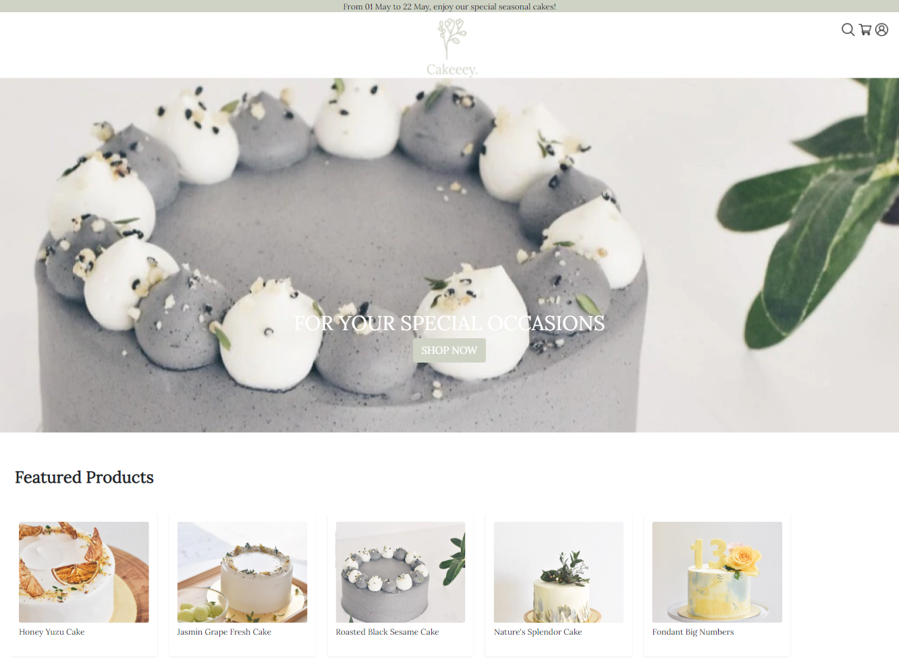
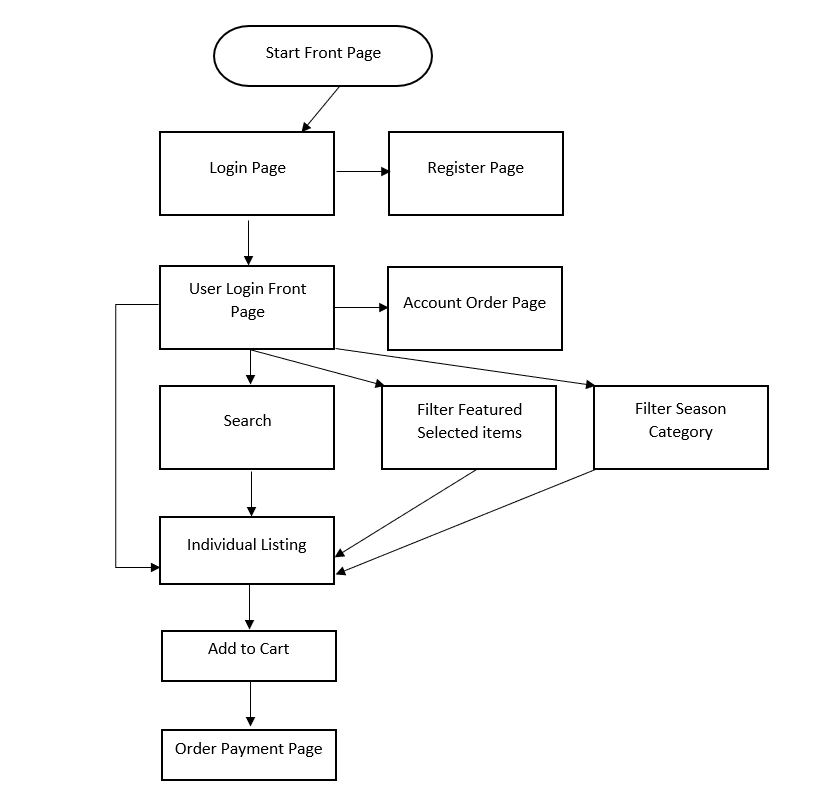

# Cakeeey.
 

Access the live demo of the website [here](https://cakeeey.netlify.app/).

## Project Summary

**Project Context**

 _Cakeeey._ is a nature focused themed artisan e-commerce shop that is involved with the sales of cakes and help the a specialised bakery business to connect, market and recieve orders from customers. It aims to be the one stop shop for all baked goods for special occasions.

**User Goals**

The aim of users is to get recommendations based on the special occasion that they would be celebrating such as birthday celebrations, mother’s day etc. while ensuring the finest quality of ingredients used in the baked goods. This includes having the product to be trackable on their account.

**Organisational Goals**

The app aims to provide users with recommendations, ease of payment and consistant updates on the orders. This ensures a smooth workflow for the business which results in a stronger customer base, thus generating a healty monetary growth.

**Justification for the App**

Cakeeey. has a unique standing in the bakery space within Singapore as it focuses on artisan centric cakes. This calls for a dedicated and highly customisable web application to meet business demands. 

## UX/UI

### **Strategy**
_User_
* Objective: To be able to make an informed decision and selection before purchasing by checking out from the cart. 

* Needs: Provide users with the ablity to edit and amend their cake selections before checkingout from their cart. Letting the user to view their orders and see the status, sub total price is crucial in keeping them informed of their orders.

* Demographics:
    * Users is targeted towards the younger population where they are interested in fancy artisan bespoke cakes
    * Some users are presumed to be new to the bakery space
    * Sufficient literacy in using technological devices

User Stories | Acceptance Criteria(s)
------------ | -------------
As a customer, I want to have a search feature so that I can find the related cakes that I would purchase for the occasion. | A search feature that will include the occasion and event.
As a customer, I want to be shown the currently trending seasonal products when I enter the website so that I do not need to waste time searching for products. | Front page carousel and listing to promote on demand products. Possible to add in call to action and featured products.
As a customer, I would like to have a way to cart all my items so that I can pay for a single bill when I checkout. | Must have a shopping cart that remembers the user items along with the session ID.
As a customer, I want to be able to track my order and see the status on my profile page so that i can plan better for my celebrations | Must store and render the orders to the particular user such that they can see the status and their purchase history.

### **Scope**

_Functional Specifications_
* Have a Main page with featured products, call to action

* Have a Main page with the shop categories such as Classic cakes, summer cakes, Birthday cakes

* Have a search function that shows cakes based on Season and or name

* Have a filter function by season

* To be able to see the listing details which size, quantity and be able to cart

* Have a cart system to save the added items to the user’s cart

* Must have a user login system where users will have to login first before carting their items

_Non-functional requirements_
* Mobile responsiveness
    * Achieved via the use of appropriate media queries and flex box

### **Structure**

 

### **Skeleton**

Access the Figma skeleton framework [here](https://www.figma.com/file/nN2aLtFO91sTbXokPyYROr/Cakeeey.).

